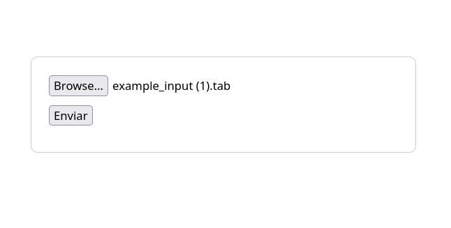
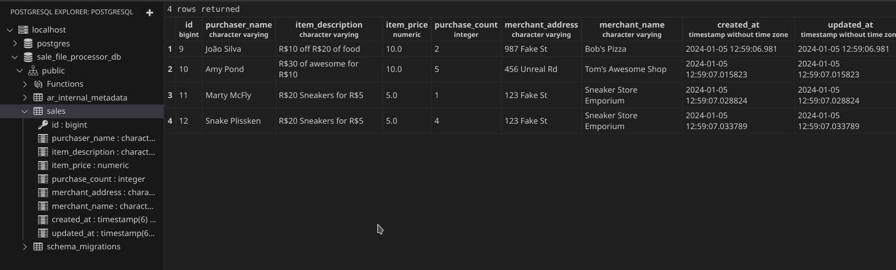

# Sale File Processor

## Descrição

O Sale File Processor é uma aplicação Rails simples para processar arquivos de vendas, calcular o saldo total e exibir os resultados.

## Requisitos

- Ruby (versão recomendada: 3.0.0)
- Rails (versão recomendada: 7.0.0)
- Docker

## Configuração

1. Clone o repositório:

```
bash
git clone https://github.com/seu-usuario/sale-file-processor.git
cd sale-file-processor
```

2. Instale as dependências:
```
bundle install
```

3. Execute o contêiner do PostgreSQL:
```
docker run --name sale_file_processor_db -e POSTGRES_PASSWORD=secretpassword -p 5432:5432 -d postgres
```

4. Crie e migre o banco de dados:
```
rails db:create
rails db:migrate
rails db:seed
```

## Executando a aplicação

1. Inicie o servidor Rails:
```
rails server
```

## Demonstração do projeto

1. Formulário de upload de arquivos .tab



2. Cálculo de balanço total do arquivo feito upload


3. Dados do arquivo salvos no banco

